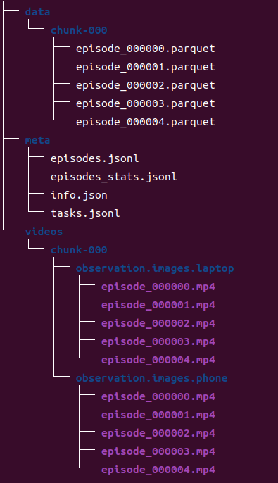

lerobot的数据集格式如下


data里面是机械臂轨迹信息，videos是每个相机视角采集的视频，meta里面是一些统计和描述信息

episodes_stats.jsonl、轨迹数据和相机采集视频已经自动收集好，可以直接放入相应文件夹中

episodes.jsonl,info.json,task.json已经在doc中给出模板


```
#显示数据集
#将从网盘或者自己训练的数据集移动到huggingface缓存中
#缓存默认路径为/home/{user}/.cache/huggingface/lerobot/{HF_USER}
cd lerobot
HF_USER=$(huggingface-cli whoami | head -n 1)
echo $HF_USER
python lerobot/scripts/visualize_dataset_html.py \
  --repo-id ${HF_USER}/so100ge

#训练模型
python lerobot/scripts/train.py \
  --dataset.repo_id=${HF_USER}/so100ge \
  --policy.type=act
  
#如果训练出现问题可以尝试运行下面这条命令
pip install torchcodec==0.2.1
```
